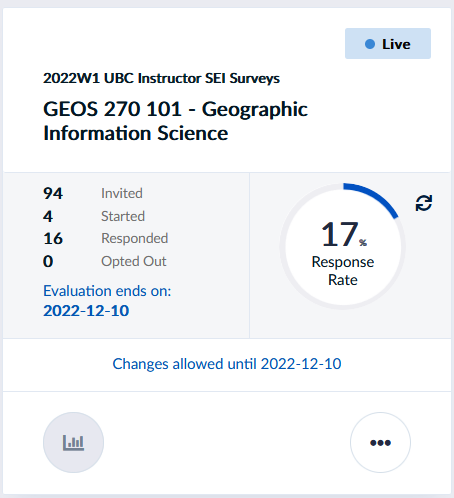

# Final Exam Review

**The review recording will not be available on canvas during the exam period.**

The final exam will be asynchronous on canvas.  You will have a 48 Hour Window to Complete (0:00 December 15th to 23:59 December 16th).  *unless an accommodation has already been discussed*

* One Attempt - five hours
    * Not intended to take five hours, I just don’t want you to feel rushed.
  * If you have an accommodation for extra time, please email me a reminder to before the exam to ensure I've set it for your exam.

* The exam is open book - you can reference any course material or outside sources you want
  * Be weary of outside materials - they may not be correct ...
  * **DO NOT** copy/paste answers.  Answers must be in your own words.  Plagiarism will be taken seriously and could result in a zero.

## Essays (30 pts x3)

* No definitive word count/limit.  Responses can be brief, but should be thorough.  Use full sentences and answer all parts of the question.
  * Give examples!
  * Sketches/Illustrations can be incorporated (*not required/expected*)
  * Type them up and submit as .pdf
    * **Make Sure it's a .pdf!**
    * Formats like .pages - are not readable across platforms
  * Randomly assigned from a bank!

* You can expect:
  * 1 essay on Spatial Coordinate Systems [Module 2](https://geos270.github.io/Module2/)
  * 1 essay on Data Types and Spatial Data Models [Module 3](https://geos270.github.io/Module3/) & [Module 4](https://geos270.github.io/Module4/)
  * 1 essay Uncertainty or Ethics [Module 6](https://geos270.github.io/Module6/)

## Flowchart (50 pts x1)

Tests your ability to work through a problem using GIS methods.  Create a flow chart outlining a GIS analysis in response to a prompt.  I suggest you use [diagrams.net](https://app.diagrams.net/) because its easy to create clean flowcharts quickly, but you can do it however you'd like.  You might want to practice making a flowchart before exam time.

The processes you'll want to be familiar with were covered in [Module 5](https://geos270.github.io/Module5/) & [Module 6](https://geos270.github.io/Module6/)
* When exporting to submit, make sure to export/submit a .png, .jpg, or .pdf
* Think about design principals - aesthetics will be a small portion of the flowchart grade.

### Practice Question 1

**Prompt**: Based on your analysis from the Tsunami Risk Assessment, the city of Port Alberni has been given funding build a new evacuation shelter.  You have been contracted by the city and tasked with finding a suitable location for the shelter.

**Criteria**: The shelter must:

* Be located outside of any potential inundation zone (Elevation > 15 m **or** distance from coastline > 1 km).
* Be at least 1.5 km away from existing shelters.
* Located no more than 250 m away from an Arterial Roadway.
* Cannot be located on Residential, Commercial, or Industrial Parcels

**Data**

|Name      |      Type          |  Coordinate System  |  Attributes |
|----------|--------------------|---------------------|-------------|
|Digital Elevation Model |Raster|UTM Zone 10N | Elevation (m) |
|BC Coastal Boundary File|Vector (line) |UTM Zone 10N | Name |
|BC Roads Layer |Vector (line) |UTM Zone 10N | Road Type (Arterial, Residential, Private), Name |
|Properties |Vector (polygon) |UTM Zone 10N | Zoning Type (Residential, Commercial, Industrial, Parks, Government/ Institutional) |
|Current Shelters |Text (.csv)|WGS 1984 | Latitude/Longitude, Name, Capacity |

### Practice Question 2

**Prompt**: June is looking for the best places in BC to pick salmonberries and they have asked you for help!  

**Criteria**: June will only pick on public land.  Salmon berries prefer:

* Deciduous Tree Cover
* Moist forest (At least 1000 mm rainfall / year)
* Cool summers (Mean July Temperatures < 25 C)
* Lower Elevation (< 1500 m)

**Data**

|Name      |      Type          |  Coordinate System  |  Attributes |
|----------|--------------------|---------------------|-------------|
|July NDVI |Raster|WGS 1984 | NDVI |
|January NDVI|Raster|WGS 1984 | NDVI |
|BC Land Tenure |Vector (Polygon) |BC Albers | First Nation/Crown/Private/|
|July Temperature Data |Text (.csv)|WGS 1984 | Latitude/Longitude, Name, Temperature |

**Suggested Steps**:

* July Temperature Data >> Display XY & Project (Albers) >> IDW
* Both NDIV >> Reproject (Albers)
* Reclassify >> NDVI & Temperature 
* Raster Calculator/Weighted Overlay (All Raster Layers)
* Raster to Vector (Suitable Areas)
* Select Crown Land > Clip Suitable Areas

## Short Answer Questions (10 pts x6)

Generally, 1-3 sentences will suffice.  Try not to write much more than a paragraph.  Bullet point lists are sufficient where applicable.  Anything from lecture/lab is fair game.

* Explain a key concept in your own words or give examples of a specific issue.

### Remaining Questions

The exact breakdown may change slightly, but you can expect:

* 5pts x5 **Fill in the blanks**

* 4pts x1 **Matching**

* 2pts x8 **Multiple Choice**

* 1pt x5 **True/False**

### Extra Credit

Write a positionality statement for your final project.  (Up to 10 pts)

* See [Module 6](https://geos270.github.io/Module6/docs/content/Ethics.html#/26) and [June's example](https://police-involved-deaths-ca.github.io/Data/docs/About.html#positionality-statement)

# Teaching Evaluations!

I value your feedback!  Please if you haven't done so already! fill them out so I can think about how to improve my teaching going forward!

* What worked for you & what didn't?
* How was the pace & format?
  * Anything I should spend more time on?
  * Did you find any modules particularly difficult?

* They also help my future employment prospects :)

## About Evaluations

Teaching evaluations are anonymous and not released to professors until after the final exam.  

You can follow [this link](https://go.blueja.io/JO0ANrkNjEyxWfjKVFKr1A) or scan the QR code below to go to th

