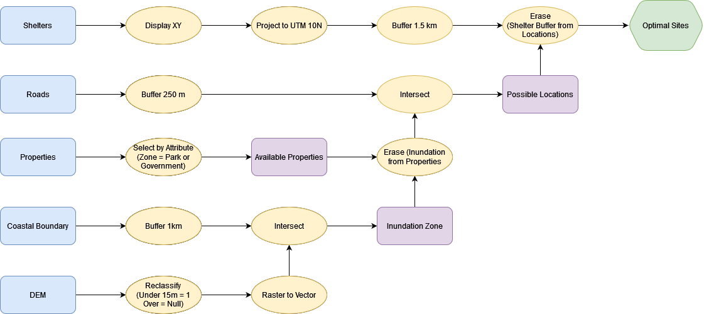

# Final Exam Review

The final exam will be asynchronous on canvas.  You will have a 48 Hour Window to Complete 

* Monday April 24th (0:00) to Tuesday April 25th (23:59).  

* One Attempt - five hours
    * Not intended to take five hours, I just don’t want you to feel rushed.
  * If you have an accommodation for extra time, please email me a reminder to before the exam to ensure I've set it for your exam.

* The exam is open book - you can reference any course material or outside sources you want.
  * Be weary of outside materials - they may not be correct ...
  * **DO NOT** copy/paste answers.  Answers must be in your own words.  Plagiarism will be taken seriously and could result in a zero.

## What's on the Exam?

There will be four parts to your exam.  Questions will be assigned randomly from a question bank.  No two students will have the same exam.  The following point breakdown is approximate and may change slightly:

* A Flowchart (50 pts)
* Essays (60 pts)
* Short Answer (50 pts)
* Automated Questions (90 pts)
  * Fill in the Blank
  * Multiple Choice
  * Matching
  * True False
  * Numeric Answer

### Flowchart 

Tests your ability to work through a problem using GIS methods.  Create a flow chart outlining a GIS analysis in response to a prompt.  I suggest you use [diagrams.net](https://app.diagrams.net/) because its easy to create clean flowcharts quickly, but you can do it however you'd like.  You might want to practice making a flowchart before exam time.

The processes you'll want to be familiar with were covered in [Module 5](https://geos270.github.io/Module5/) & [Module 6](https://geos270.github.io/Module6/)
* When exporting to submit, make sure to export/submit a .png, .jpg, or .pdf
* Think about design principals - aesthetics will be a small portion of the flowchart grade.

#### Practice Question 1

**Prompt**: Based on your analysis from the Tsunami Risk Assessment, the city of Port Alberni has been given funding build a new evacuation shelter.  You have been contracted by the city and tasked with finding a suitable location for the shelter.

**Criteria**: The shelter must:

* Be located outside of any potential inundation zone (Elevation > 15 m **or** distance from coastline > 1 km).
* Be at least 1.5 km away from existing shelters.
* Located no more than 250 m away from an Arterial Roadway.
* Cannot be located on Residential, Commercial, or Industrial Parcels

**Data**

|Name      |      Type          |  Coordinate System  |  Attributes |
|----------|--------------------|---------------------|-------------|
|Digital Elevation Model |Raster|UTM Zone 10N | Elevation (m) |
|BC Coastal Boundary File|Vector (line) |UTM Zone 10N | Name |
|BC Roads Layer |Vector (line) |UTM Zone 10N | Road Type (Arterial, Residential, Private), Name |
|Properties |Vector (polygon) |UTM Zone 10N | Zoning Type (Residential, Commercial, Industrial, Parks, Government/ Institutional) |
|Current Shelters |Text (.csv)|WGS 1984 | Latitude/Longitude, Name, Capacity |

#### Practice Question 2

**Prompt**: June is looking for the best places in BC to pick salmonberries and they have asked you for help!  

**Criteria**: June will only pick on public land.  Salmon berries prefer:

* Deciduous Tree Cover
* Moist forest (At least 1000 mm rainfall / year)
* Cool summers (Mean July Temperatures < 25 C)
* Lower Elevation (< 1500 m)

**Data**

|Name      |      Type          |  Coordinate System  |  Attributes |
|----------|--------------------|---------------------|-------------|
|July NDVI |Raster|WGS 1984 | NDVI |
|January NDVI|Raster|WGS 1984 | NDVI |
|Digital Elevation Model |Raster|WGS 1984 | Elevation (m) |
|BC Land Tenure |Vector (Polygon) |BC Albers | First Nation/Crown/Private/|
|BC Climate Data |Text (.csv)|WGS 1984 | Latitude/Longitude, Name, Monthly Mean Temperature, Monthly Total Rainfall |

**Suggested Steps**:

* July Temperature Data >> Display XY & Project (Albers) >> IDW
* Both NDIV >> Reproject (Albers)
* Reclassify >> NDVI & Temperature 
* Raster Calculator/Weighted Overlay (All Raster Layers)
* Raster to Vector (Suitable Areas)
* Select Crown Land > Clip Suitable Areas

### Essays

* No definitive word count/limit.  Responses can be brief, but should be thorough.  Use full sentences and answer all parts of the question.
  * Give examples!
  * Sketches/Illustrations can be incorporated (*not required/expected*)
  * Type them up and submit as .pdf
    * **Make Sure it's a .pdf!**
    * Formats like .pages - are not readable across platforms
  * Randomly assigned from a bank!

* You can expect:
  * 1 essay on Spatial Coordinate Systems [Module 2](https://geos270.github.io/Module2/)
  * 1 essay on Data Types and Spatial Data Models [Module 3](https://geos270.github.io/Module3/) & [Module 4](https://geos270.github.io/Module4/)

### Short Answer Questions

Generally, no more than a paragraph needed.  Bullet point lists are sufficient where applicable.  Anything from lecture/lab is fair game.

* Explain a key concept in your own words or give examples of a specific issue.

### Automated Questions

These questions will include a mix of different question types that will be marked automatically.  

* I will provide you with a special answer sheet that you **need** to used to record and upload your answers.  Make sure to follow the specific instructions provided so your answers are handled correctly.

## What is Plagiarism?

"Plagiarism is presenting work or ideas from another source as your own, with or without consent of the original author, by incorporating it into your work without full acknowledgement." - Oxford English Dictionary

### How to avoid plagiarizing on an open book exam?

**Put answers in your own words.**

* Its perfectly okay to reference course material and other outside resources.  However, the ideas presented must reflect your own understanding of the information presented.

#### ChatGPT?

Its an amazingly powerful tool!  That said ... its a C student at best.  Don't copy/paste exam answers from ChatGPT - you'd be surprised how often it will generate incorrect information.  

* You **can** use Chat GPT as a study tool.
  * Unsure what the difference between the a Geographic Coordinate System and a Map Projection? 
    - Ask Chat GPT and see what it says.
    - Cross reference its answer with **other sources** (e.g. lecture material) to solidify your understanding **and** make sure it didn't give you any misinformation.

* You **cannot** use Chat GPT to answer exam questions for you.  That is plagiarism.

#### Top Hat Question

Which of the following are examples of plagiarism?

* Typing exam questions into ChatGPT and using its response as your answer.
* Paraphrasing a full paragraph from a research paper or other article without citation.
* Using Chat GPT as a study tool to help prepare for an exam.
* Synthesizing information from multiple online sources to answer an essay question.
* Copying full sentences from lecture slides and putting them in an essay.
